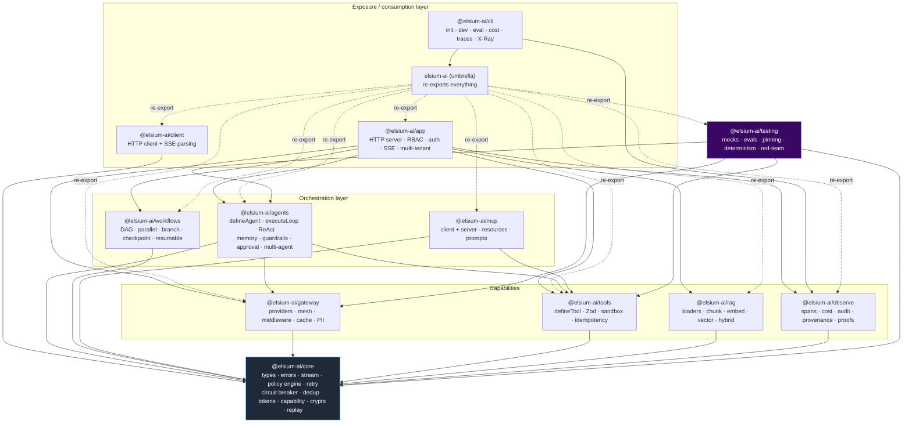
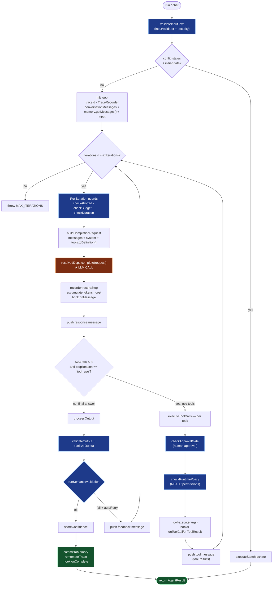
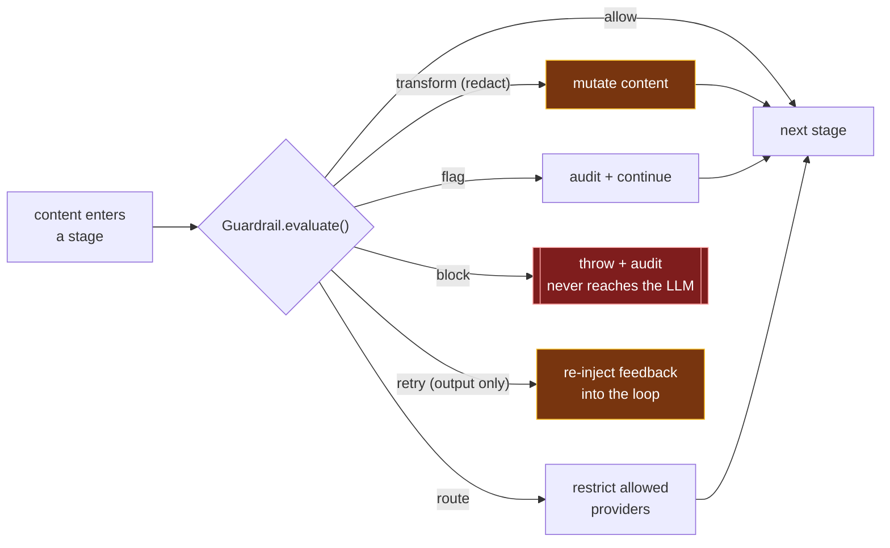
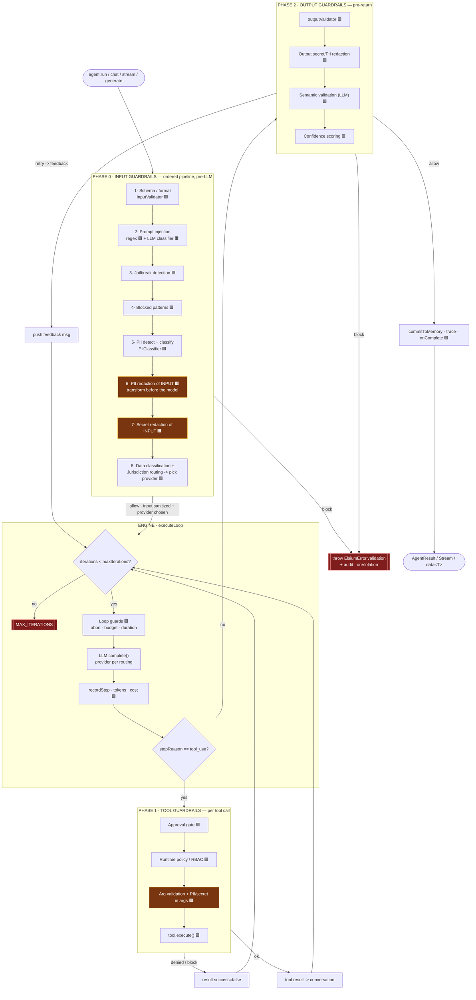

# Architecture Diagrams

Visual reference for ElsiumAI's package layout, the agent runtime, and the
proposed phased guardrail pipeline.

> **Status legend**
> - Diagrams 1–3 describe the **current implementation** (as in `packages/`).
> - Diagrams 4–5 describe the **phased guardrail design**. The input-side
>   redaction stages (🟧 in diagram 5: input PII/secret redaction and tool-arg
>   secret redaction) are now implemented and opt-in via `AgentSecurityConfig`
>   (`redactInputSecrets`, `redactInputPii`, `redactToolArgSecrets`,
>   `injectionClassifier`) and `securityMiddleware({ redactInput })`. The LLM-backed
>   injection classifier ships as an injectable `injectionClassifier` hook rather
>   than a built-in model call.

---

## 1. Layered architecture (packages & dependencies)

Shows how the monorepo packages stack up and depend on each other. Everything
descends to `@elsium-ai/core` (ports + types, backend-agnostic: in-memory only,
the user supplies durable adapters). `testing` sits apart because it wraps the
others without being a production dependency of anything.



---

## 2. Agent engine — inputs & outputs

The black-box view of an agent: the entry methods and configuration that go in,
the injected dependencies the engine relies on, and the result shapes that come
out. The engine itself is `defineAgent` → `executeLoop`.


---

## 3. The engine core — `executeLoop`

The actual ReAct loop every agent runs (`packages/agents/src/agent.ts:406`).
The LLM responds; if it requests tools they are executed and fed back into the
context; otherwise the response is finalized. Governance checks live *inside* the
loop (blue nodes), not around it — this is the framework's differentiator.



---

## 4. Guardrail verdict semantics (proposed)

Proposed unified contract so every guardrail speaks the same language. Each
guardrail's `evaluate()` returns one explicit verdict; the pipeline acts on it.
`transform` is how PII/secret redaction mutates content in place; `block` stops
the request before it reaches the LLM; `retry` (output phase only) re-injects
feedback into the loop.



Proposed contract sketch:

```typescript
type GuardrailPhase = 'input' | 'tool' | 'output'

interface Guardrail {
  name: string
  phase: GuardrailPhase
  evaluate(ctx: GuardrailContext): GuardrailVerdict | Promise<GuardrailVerdict>
}

type GuardrailVerdict =
  | { action: 'allow' }
  | { action: 'transform'; value: string }         // PII/secret redaction — mutate & continue
  | { action: 'flag'; reason: string }             // audit & continue (non-blocking)
  | { action: 'route'; allowProviders: string[] }  // jurisdiction (input only)
  | { action: 'block'; reason: string; severity }  // stop: throw + audit
  | { action: 'retry'; feedback: string }          // output only -> re-inject into loop
```

---

## 5. Full phased guardrail flow (proposed, integrated with the engine)

End-to-end view with the proposed guardrail pipeline wired into the existing
`executeLoop`. Guardrails run as an **ordered pipeline per phase**: the pipeline
accumulates `transform` results (progressively redacted text), stops at the first
`block`, and applies the sanitized content at the end of each phase.

🟩 already exists in the codebase · 🟧 new stage to be added



### How the phases act

| Phase | When | Typical actions | On failure |
|-------|------|-----------------|------------|
| **0 · Input** | once, before the loop | redact PII/secrets, detect injection/jailbreak, classify + route | `block` -> never reaches the LLM |
| **Loop guards** | every iteration | abort / budget / duration | bounded throw |
| **1 · Tool** | before *each* `tool.execute()` | approval, RBAC, validate + redact args | `block` -> `result success=false`, loop continues |
| **2 · Output** | before returning the response | validate, redact, semantic, confidence | `retry` (re-inject) or `block` |

**Key design decisions:**
- The 8 input stages form an **ordered pipeline**: redaction (6, 7) runs *after*
  injection/jailbreak detection (2–4) and *before* routing (8), so classification
  and routing operate on already-sanitized text.
- The new stages (🟧) **reuse existing patterns** (`PII_PATTERNS`,
  `SECRET_PATTERNS`); they are hooked into pre-processing plus a new
  `sanitizeInput` entry point.
- Every verdict is **audited**, fitting the hash-chained audit trail in
  `@elsium-ai/observe`, so any `block`/`transform` is recorded.
